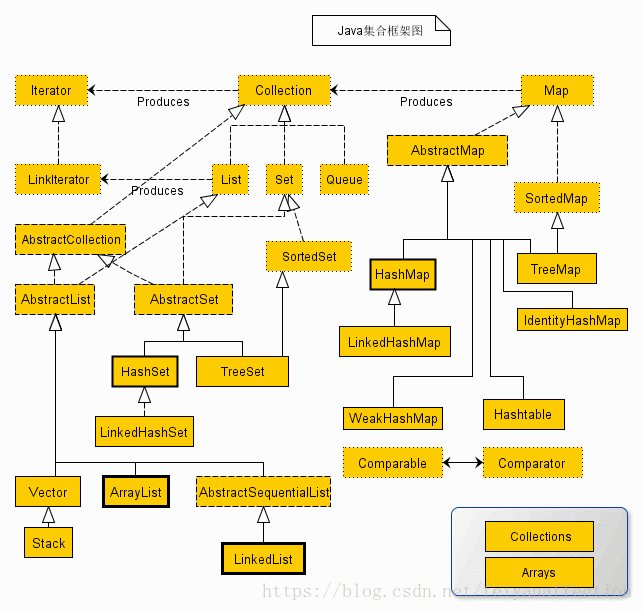

## SE部分

1. String a="123"; String b="123";String c = new String("abc"); a,b,c的关系?

   ```
      a==b true a==c b==c false
      具体参考String info 的类
       new 是在堆内存中额外开辟出来的空间,== 是比较内存地址并不是值,equals比较的是值,而equals而言，如果没重写，用equals比较本质上还是==，如果重写之后比较的是用新的equals进行比较。
       针对==，如果两边是数据类型变量直接比较值，如果两边是引用类型变量那么比较的就是两者之间的地址值。
   ```

2. 为什么要重写equals一定得重写hashcode?

   ```
   hashcode其实类似于一个坐标(可以将之总结成物理地址(并不是))每个对象的生成的hash值指向了一个物理地址,这样，如果生成的hash相同，就到对应的物理地址去比较两个值是否相等
   如果hash不一样就在新的地方开辟一个物理地址。
   hash值相同，用equals比较时不代表两个结果相同。hash值不同用equals比较时两个结果一定不同
   equals比较时为true,hash一定相同，如果为false，hash不一定不同。重写equals就必须得要重写hashcode的原因是为了保证hash唯一性。如果hash值相同，而equals的结果为false，这个会在数组内部构成一个数组。而相同的hash也就构成了我们所知的hash冲突也就是hash碰撞。
   详情可以见HashMapInfo
   ```

3. HashMap的equals和hashCode什么时候需要重写,如果不重写会怎么样？

   ```
   首先详见HashMapInfo
   如果实体类对象未重写eq和hash,那么如果作为hashmap/hashset的key就会出现一个问题，hashset/hashmap是不允许有重复的key的，这样会导致他们的key值出现相同的值，原因是每次新建一个对象，都会堆开辟一块空间，，而hashset的比较是通过equals进行比较的，equals未重写那直接比较的就是地址值，而地址对应的是不同的空间，自然必定是不相同的。
   ```

4. collection和map也就是集合的所有知识点

   具体内容如下图:

   

   ```
   集合有Collection和Map
   Collection中有List和Set,
    其中List又分为ArrayList,LinkedList,Vector
    其中Set中又分为HashSet,LinkedHashSet,TreeSet
   Map又有如下的Map，HashMap,LinkedHashMap,IdentityHashMap,HashTable,WeakHashMap
   ```

5. ArrayList和LinkedList

   ```
   ArrayList底层是数组而LinkedList底层是链表
   
   数组适合查询而链表适合删除修改。源码中ArrayList的初始容量为10,然后每次调用add方法size都会+1,等到当前数组的扩容的长度(也就是+1)>数据的长度elementData.length,如果是初始情况下，这个长度为10，之后调用grow方法进行扩容1.5倍并使用数组的复制。
   链表的扩容还是比较简单的，直接加入最后一个节点。
   ```

6. volatile 关键字用来修饰变量

   ```
   1.  主要作用就是修饰的变量具有可见性，在多线程的情况下可以做到线程数据共享。【推荐一个线程来修改，其余线程来读取。这样效率比较高】
   2.  volatile 修饰的变量不具备原子性。
   	不能做做线程安全计数器，不能用来修饰多个线程可修改的变量
   	为了确保共享变量能被准确和一致地更新 线程应该确保通过排他锁(synchronized)单独的获取这个变量或者通过CAS，原子操作
   ```

7. 

8. 

9. 

10. 

11. 

12. 

13. 

14. 

15. 

16. 

17. 

18. 

19. 

20. 

21. 

22. 

23. 

24. 

25. 

26. 

27. 

28. 

29. 

30. 

31. 

32. 

33. 

34. 

35. 

36. 

37. 

38. 

39. 

40. 

41. 

42. 

43. 

44. 

45. 

46. 

47. 

48. 

49. 

50. 

51. 

52. 

53. 

54. 

55. 

56. 

57. 

58. 

59. 

60. 

61. 

62. 

63. 

64. 

65. 

66. 

67. 

68. 

69. 

70. 

71. 

72. 

73. 

74. 

75. 

76. 

77. 

78. 

79. 

80. 

81. 

82. 

83. 

84. 

85. 

86. 

87. 

88. 

89. 

90. 

91. 

92. 

93. 

94. 

95. 

96. 

97. 

98. 

99. 

100. 

101. 

102. 

103. 

104. 

105. 

106. 

107. 

108. 

109. 

110. 

     

     

